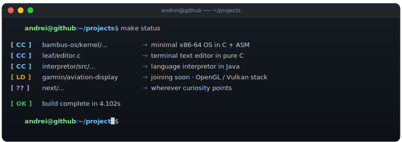
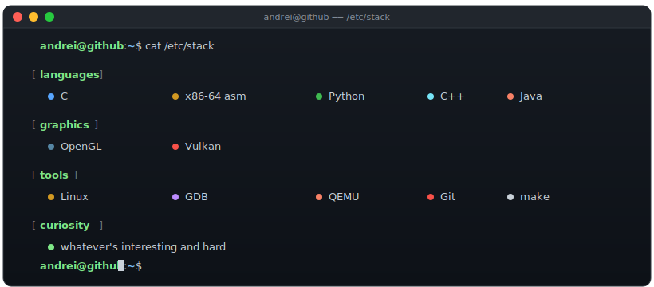
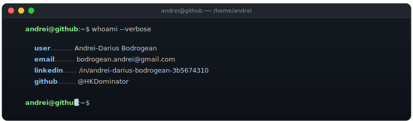

<!--
  README — andrei-os v22.0
  All visual content lives in matching .svg files. Edit those, not this.
-->

  <a href="mailto:bodrogean.andrei@gmail.com">↗&nbsp;open&nbsp;mail</a>
  &nbsp;·&nbsp;
  <a href="https://linkedin.com/in/andrei-darius-bodrogean-3b5674310">↗&nbsp;open&nbsp;linkedin</a>

