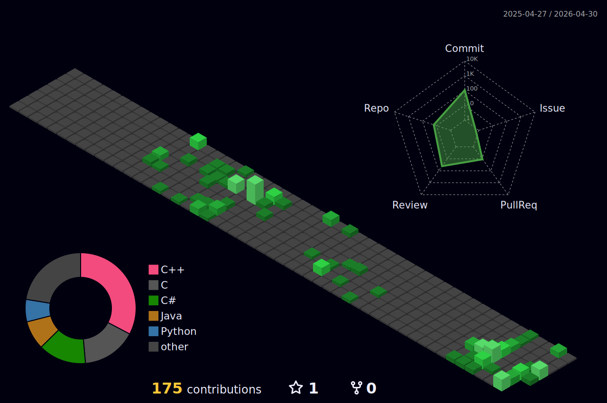

<!--
  README — andrei-os v22.0
  Drop into <USERNAME>/<USERNAME>/README.md
  Search-and-replace: USERNAME, YOUR_EMAIL, YOUR_LINKEDIN
-->

<!-- 1. Boot-log typing animation ────────────────────────────────── -->
<p align="center">
  
</p>

---

<!-- 2. Neofetch-style identity ──────────────────────────────────── -->

```sh
   ╔══════════╗
   ║  $ ▓▓ _  ║   andrei@github
   ║  ▓▓▓▓▓▓  ║   ─────────────────────────────────────────────
   ╚══════════╝   os........... AndreiOS v21.0 (rolling release)
                  host......... babes-bolyai.cluj
                  kernel....... linux 6.x
                  uptime....... coding since 2018
                  shell........ zsh + nvim
                  editor....... leaf (self-hosted, pure C)
                  projects..... bambus-os · leaf · grep
                  langs........ C · x86-64 asm · Python · C++ · Java
                  focus........ low-level systems · graphics · open to wherever curiosity points
                  next......... OpenGL / Vulkan · aviation displays @ Garmin
                  cpu.......... caffeine @ 4.9GHz
                  gpu.......... integrated curiosity
```

---

<!-- 3. Build status ─────────────────────────────────────────────── -->

### `$ make status`

```
[ CC  ]  bambus-os/kernel/...      → minimal x86-64 OS in C + ASM
[ CC  ]  leaf/editor.c             → terminal text editor in pure C
[ CC  ]  interpretor/src/...       → language interpretor in java
[ LD  ]  garmin/aviation-display   → joining soon · OpenGL/Vulkan stack
[ ??  ]  next/...                  → wherever curiosity points
[ OK  ]  build complete.
```

---

<!-- 4. Stats (dark/light responsive via <picture>) ──────────────── -->

<p align="center">
  <picture>
    <source media="(prefers-color-scheme: dark)" srcset="https://github-readme-stats.vercel.app/api?username=HKDominator&show_icons=true&count_private=true&include_all_commits=true&theme=tokyonight&hide_border=true&card_width=480" />
    <source media="(prefers-color-scheme: light)" srcset="https://github-readme-stats.vercel.app/api?username=HKDominator&show_icons=true&count_private=true&include_all_commits=true&theme=default&hide_border=true&card_width=480" />
    
  </picture>
</p>

<p align="center">
  <picture>
    <source media="(prefers-color-scheme: dark)" srcset="https://github-readme-streak-stats.herokuapp.com?user=HKDominator&theme=tokyonight&hide_border=true" />
    <source media="(prefers-color-scheme: light)" srcset="https://github-readme-streak-stats.herokuapp.com?user=HKDominator&theme=default&hide_border=true" />
    
  </picture>
</p>

<p align="center">
  <picture>
    <source media="(prefers-color-scheme: dark)" srcset="https://github-readme-stats.vercel.app/api/top-langs/?username=HKDominator&layout=compact&theme=tokyonight&hide_border=true&langs_count=8" />
    <source media="(prefers-color-scheme: light)" srcset="https://github-readme-stats.vercel.app/api/top-langs/?username=HKDominator&layout=compact&theme=default&hide_border=true&langs_count=8" />
    
  </picture>
</p>

---

<!-- 5. 3D contribution graph (auto-generated nightly) ──────────── -->

<p align="center">
  
</p>

---

<!-- 6. Stack ─────────────────────────────────────────────────────── -->

### `$ cat /etc/stack`

<p>
  
  
  
  
  
  
  
  
  
  
</p>

---

### `$ whoami --contact`

<p>
  <a href="mailto:bodrogean.andrei@gmail.com"></a>
  <a href="https://linkedin.com/in/andrei-darius-bodrogean-3b5674310"></a>
  <a href="https://github.com/HKDominator"></a>
</p>

<p align="right"><sub><i>uname -r: andrei-os 22.0 · last build: auto-updated daily by github actions</i></sub></p>
